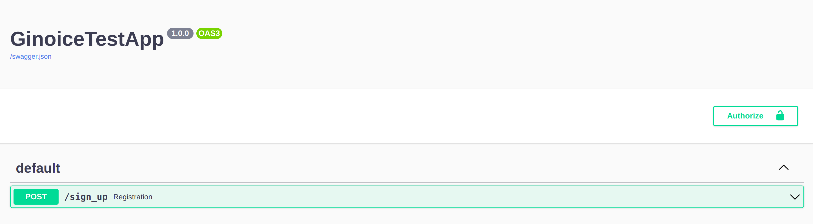
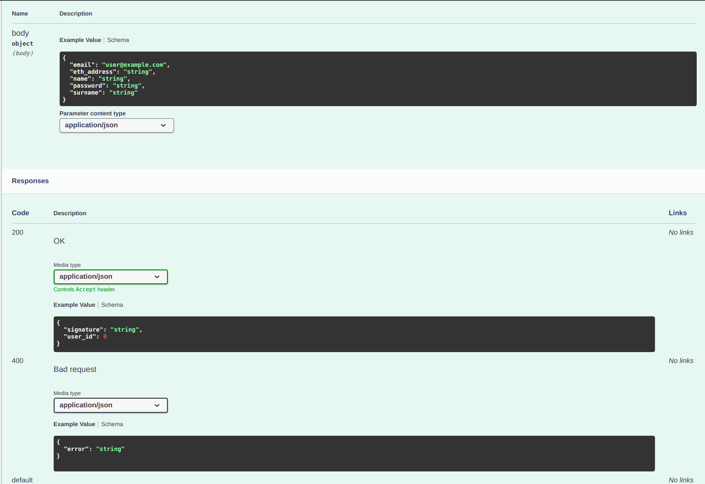
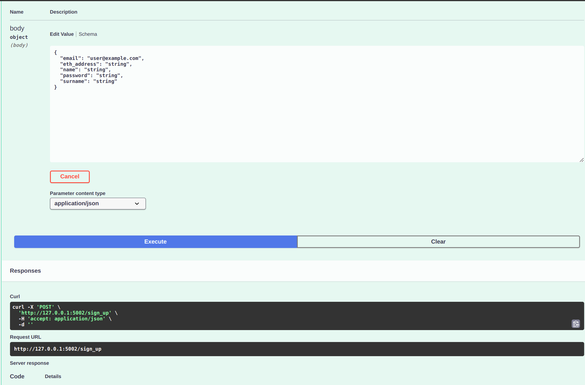

# Тестовое Задание
Необходимо написать бэкенд со следующими эндпоинтами:
1. Регистрация
2. Вход
3. Получения данных пользователя

Необходимо автоматическое документирование эндпоинтов с помощью apispec (https://apispec.readthedocs.io/en/latest/), marshmallow, etc.
Запросы к БД проводить через любую удобную ORM и транзакции.

Стек: `Python Flask`, `SQL`, `Web3` (https://web3py.readthedocs.io/en/stable/)

### 1. Регистация(POST: /sign_up)
##### Запрос

    {
      "name": "", 		# имя пользователя
      "surname": "",        # фамилия пользователя
      "email": "", 		# email пользователя
      "eth_address": "", 	# ethereum кошелек пользователя
      "password": ""        # пароль от 8 символов с цифрами и заглавными буквами
    }

##### Операции:

При получении данных сервером, необходимо провалидировать email и пароль, после чего записать их в БД. В качестве БД можно использовать `SQLite`, либо `PostgreSQL` при условии использования `docker-compose`.

После того как сервер записал в БД, нам необходимо взять user ID и с использованием библиотеки `Web3.py` произвести с ним следующие действия:
- Хешировать в Keccak256  
При преобразовании типом данных для user ID должно быть uint256  
Для проверки:   
`user ID: 123` => `hash:0x5569044719a1ec3b04d0afa9e7a5310c7c0473331d13dc9fafe143b2c4e8148a`  
- Преобразовать хеш в Ethereum Signed Message  
Для проверки:   
`hash:0x5569044719a1ec3b04d0afa9e7a5310c7c0473331d13dc9fafe143b2c4e8148a` => `ethHash:0x43dddc6fa8c46dff6aa09673625c5a9edc8ab273727e7c97202a550d60e7d927`  
- Подписать Ethereum Signed Message приватным ключом  
Приватный ключ:
`0d2dacbdc69bee88720ea2f9d5652ad0941303c6fe4e9e269869e312279970a0`  
Адрес кошелька:
`0x0914B7665920386a9F05a53e83d1c999B25Eedb5`  
Для проверки:
`ethHash:0x43dddc6fa8c46dff6aa09673625c5a9edc8ab273727e7c97202a550d60e7d927` => `signature:0xd46f930774942cd133304705cf20c0a44c02b13f470d3bd515f894d3570a86e269572dcf0b3139fb1c8bc1d0e3dd83f48b488b1547c1d875f506cb6a22a7a87a1b`

##### Ответ

    {
      "user_id": 0 		# id пользователя
      "signature": “0x…” 	# подписанный хеш полученный из user_id
    }

### 2. Вход(POST: /sign_in)
##### Запрос

    {
      "email": "example@mail.ru",   # email пользователя
      "password": ""                # пароль пользователя
    }

##### Операции
Сервер создает auth_token, необходимый для чтения данных пользователя и сохраняет его в БД

##### Ответ

    {
      "auth_token": "dfkjsdfjkhsdf"    # код авторизации
    }

### 3. Получение данных пользователя(GET: /user)
##### Запрос
Пользователь передает заголовок с токеном авторизации  
`Bearer: <auth_token>`
##### Операции
Бэкенд проверяет существование токена и какому пользователю токен выпущен, после чего отдает информацию по соответствующему пользователю.
##### Ответ

    {
      "name": "", 		# имя пользователя
      "surname": "",        # фамилия пользователя
      "email": "", 		# email пользователя
      "eth_address": "", 	# ethereum кошелек пользователя
    }

# Эпопея с `Open_Api_Interface_3+` и `Swagger_2.0` 
Мне взбрело в голову, что непременна нужна поддержка логина через интерфейс Swagger'a. Из ТЗ следует что мне нужна `bearerAuth`, которая поддерживается только в `OAI3+`. Поэтому большинство удобных инструментов для документации API _(как позднее оказалось)_ отпадает. Я же захотел использовать инструменты документации для Swagger 2, что бы документировать OAI3.  
И _(спустя достаточно количество времени)_ у меня, казалось бы, получилось!  

Появилась кнопка авторизации, и даже нужное мне поле:
  

Получилось заставить появиться `ExampleValue`(напомню, что я пихал новые структуры _(структура ответа претерпела сильные изменения)_ в старые инструменты, а именно в `flask_apispec` (-_-))

И всё было хорошо, пока я не попытался получить данные на сервере.
Ничего не выходило! Оказалось, что по какой-то, _неведомой мне до сих пор_, причине SwaggerUI составлял совершенно некорректный запрос, не отражающий действия в UI.

Я попытался разобраться в чём проблема, но так как потратил на такую простую задачу, как составление "скелета" API, много ~~ОЧЕНЬ УЖ МНОГО~~ времени, решил остановиться на __"полуавтомате"__.
Для этого, в итоге, использовал стандартный `apispec` и `marshmallow`.   
